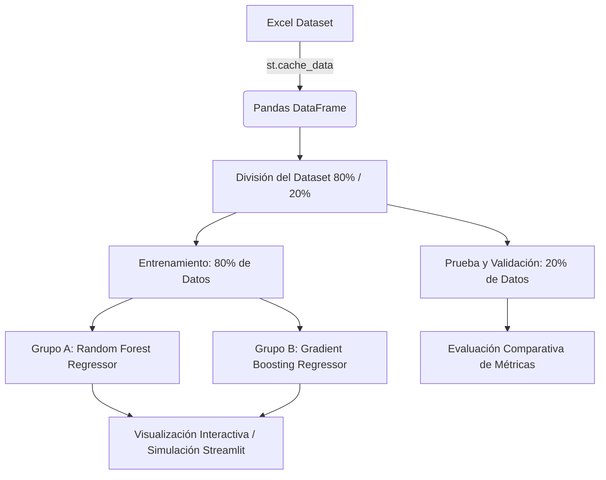

# 📦 Sistema Inteligente de Predicción de Demanda - Merkaton UIO

[](https://www.python.org/)
[](https://streamlit.io/)
[](https://scikit-learn.org/)

Este proyecto implementa un sistema inteligente de predicción de la demanda diaria para la distribuidora **Merkaton UIO** (Quito, Ecuador). A través del uso de algoritmos avanzados de **Machine Learning**, la herramienta permite simular cómo afectan las condiciones del entorno y las decisiones de precio en el volumen final de ventas, previniendo quiebres de stock y sobreabastecimiento.

FICA - Inteligencia Artificial I (Progreso 3)

---

## 📋 Tabla de Contenidos
- [Características del Sistema](#-características-del-sistema)
- [Descripción de Variables (Dataset)](#-descripción-de-variables-dataset)
- [Arquitectura y Pipeline](#-arquitectura-y-pipeline)
- [Modelos en Comparación](#-modelos-en-comparación)
- [Métricas de Rendimiento](#-métricas-de-rendimiento)
- [Gráficos Interactivos y Sensibilidad](#-gráficos-interactivos-y-sensibilidad)
- [Guía de Instalación y Ejecución](#-guía-de-instalación-y-ejecución)
- [Estructura del Proyecto](#-estructura-del-proyecto)

---

## ✨ Características del Sistema

* **Inferencia en Tiempo Real**: Panel de control interactivo para manipular variables operativas (precio, stock) y geográficas/ambientales (vías cerradas, feriados).
* **Visualización Dinámica**: Gráficos interactivos de comparación y curvas de comportamiento macroeconómico en tiempo real.
* **Entrenamiento Dual Automatizado**: Compara al instante dos grupos experimentales en el backend.
* **Carga Eficiente de Datos**: Implementación de caché de datos en Streamlit para agilizar la lectura de archivos grandes.
* **Diseño Visual Moderno**: Interfaz adaptativa, limpia y optimizada para la toma de decisiones empresariales.

---

## 📊 Descripción de Variables (Dataset)

El modelo fue entrenado utilizando el histórico registrado en `dataset proyecto.xlsx` (120 registros diarios de actividad comercial).

### Variables de Entrada (Features / Datos Predictivos)

| Variable | Tipo de Dato | Rango / Valores | Descripción |
| :--- | :--- | :--- | :--- |
| **Precio_Unit** | Numérico (Float) | `$5.30` - `$13.00` | Precio unitario del producto en dólares. |
| **Lead_Time** | Numérico (Int) | `2` - `7` días | Días de espera para el reabastecimiento del proveedor. |
| **Stock_Seg** | Numérico (Int) | `20` - `100` unid. | Stock de seguridad mínimo configurado en el inventario. |
| **Festividad** | Binario (Int) | `0` (No) / `1` (Sí) | Indica si es feriado o festivo local en Quito. |
| **Estado_Vias** | Binario (Int) | `0` (Bloqueadas) / `1` (Abiertas) | Estado de transitabilidad de las vías de acceso a la ciudad. |
| **Criticidad** | Categórico (Int) | `1` (Vital) / `2` (Esencial) / `3` (Deseable) | Nivel de urgencia o importancia del producto. |

### Variable de Salida (Target / Predictor)
* **Ventas_Unidades**: Volumen físico de ventas estimadas (Demanda diaria prevista).

---

## ⚙️ Arquitectura y Pipeline



---

## 🤖 Modelos en Comparación

Para garantizar la precisión de la predicción, se analizaron dos enfoques basados en árboles de decisión:

1. **Random Forest Regressor (Grupo A)**:
   * Basado en *Bagging* (muestreo concurrente).
   * Genera múltiples árboles independientes y promedia sus predicciones. Excelente para evitar el sobreajuste (*overfitting*), aunque tiende a ser moderado ante picos extremos de demanda.
2. **Gradient Boosting Regressor (Grupo B - Recomendado)**:
   * Basado en *Boosting* (aprendizaje secuencial).
   * Genera árboles de decisión uno tras otro, donde cada nuevo árbol aprende y corrige los errores residuales del anterior. Logra capturar de mejor manera las variaciones extremas y comportamientos complejos.

---

## 🏆 Métricas de Rendimiento

Evaluadas de manera transparente sobre el conjunto de datos de prueba (20% del total):

| Métrica | Grupo A: Random Forest | Grupo B: Gradient Boosting (Ganador) |
| :--- | :---: | :---: |
| **Coeficiente $R^2$ (Precisión)** | `0.8354` | **`0.9303`** |
| **Error Absoluto Medio (MAE)** | `9.17` unidades | **`6.53`** unidades |

> [!NOTE]  
> **Gradient Boosting** explica el **93% de la varianza** en los datos reales y posee un error promedio de apenas **6.5 unidades**, convirtiéndose en la herramienta principal para la planificación del inventario.

---

## 🚀 Guía de Instalación y Ejecución

### Requisitos Previos
Tener instalado Python (versión 3.9 o superior).

### Paso 1: Clonar el repositorio
```bash
git clone https://github.com/Santty111/IA.git
cd IA
```

### Paso 2: Instalar las dependencias
Instala los paquetes necesarios directamente desde pip:
```bash
pip install streamlit pandas numpy scikit-learn openpyxl
```

### Paso 3: Ejecutar el simulador interactivo
Inicia el servidor local de Streamlit:
```bash
streamlit run app.py
```
O bien:
```bash
python -m streamlit run app.py
```

El navegador se abrirá automáticamente en la dirección: **`http://localhost:8501`**

---

## 📈 Gráficos Interactivos y Sensibilidad

El sistema integra visualizaciones automáticas basadas en la librería Altair nativa de Streamlit, ideales para soporte en presentaciones ejecutivas y análisis comercial:

1. **Comparativa vs. Promedio Histórico**: Muestra un gráfico de barras comparando la demanda estimada de ambos modelos de IA contra la media general histórica de ventas diarias.
2. **Curva de Demanda Dinámica (Sensibilidad al Precio)**: Genera una curva interactiva de precio unitario vs. demanda diaria estimada. Cuando el usuario cambia variables del entorno en el panel lateral (vías, festividades, criticidad), **toda la curva de demanda se desplaza verticalmente** en tiempo real, demostrando visualmente conceptos de microeconomía clásica y elasticidad de precio.

---

## 📁 Estructura del Proyecto

```text
├── dataset proyecto.xlsx   # Datos históricos de ventas diarias
├── app.py                  # Código fuente de la interfaz y modelos
├── .gitignore              # Configuración de exclusiones de Git
└── README.md               # Documentación general del repositorio
```
